# **BERT**
> 语义理解中的预训练深度双向Transformer，`B`idirectional `E`ncoder `R`epresentations from `T`ransformers.[^0]
> 会议：NAACL 2019 （NAACL Best Long Paper）
> 单位：Google AI Language
> 参考文献[^1]:BERT Explained: A Complete Guide with Theory and Tutorial
> 参考文献[^2]:深入浅出解析 BERT 原理及其表征的内容
# **简介**

[《BERT: Pre-training of Deep Bidirectional Transformers for Language Understanding》](https://arxiv.org/abs/1810.04805)是NLP领域必备的一篇经典论文，BERT是由Google AI研究院提出的一种预训练模型，该论文获得了自然语言处理顶会NAACL 2019 最佳论文奖，BERT的全称是Bidirectional Encoder Representation from Transformers。BERT在机器阅读理解顶级水平测试SQuAD1.1中表现出惊人的成绩: 全部两个衡量指标上全面超越人类，并且在11种不同NLP测试中创出SOTA表现，包括将GLUE基准推高至80.4% (绝对改进7.6%)，MultiNLI准确度达到86.7% (绝对改进5.6%)，成为NLP发展史上的里程碑式的模型成就。

# **挑战**

## NLP面临的最大挑战之一：缺乏足够的训练数据
总的来说，有大量的文本数据可用，但是如果我们想要创建特定于某任务的数据集，我们需要将这些数据分成许多不同的字段。即便我们这样做了之后，我们最终只能得到几百或几十万个人类标记的训练样本。可是，为了达到更好的效果，基于深度学习的 NLP 模型需要更大的数据量，只有对数亿甚至十亿级的带注释的数据进行训练，才能达到很好的效果

## 面对挑战为什么需要BERT

为了帮助弥补这一数据量上的差距，研究人员开发了各种技术来训练通用语言模型，这些模型使用网络上的大量未加注释的文本作为数据源（这称为预训练）。这些通用的预训练模型可以在更小的特定任务数据集上进行微调，例如，当处理诸如问题回答和情绪分析、分类问题、命名实体识别、机器翻译等问题时，与从零开始在更小的任务特定数据集上训练相比，这种方法可以极大地提高准确性。BERT 是 NLP 预训练的新技术之一，它在深度学习社区引起了轰动，因为它在各种 NLP 任务中呈现出的结果是最准确的，比如问答场景。

BERT 另一个优势在于它可以免费下载和使用，我们可以使用 BERT 模型从文本中提取高质量的语言特性数据，或者我们可以调整这些模型用于某个特定的任务场景中，如情绪分析或问题回答，然后用我们自己的数据生产最优的预测结果。

# **从Word Embedding 到 BERT**

## Word  Embedding 

Word Embedding 面临的**最大问题**就是**多义词问题（歧义词问题）**，多义词是自然语言中经常出现的现象，也是语言灵活性和高效性的一种体现。比如说上图中例子中，Bank有两个常用含义（银行、河岸），但word2vec在对这个单词进行编码的时候，是区分不开这两个含义的，因为他们尽管上下文环境中出现的单词不同，但是在用语言模型训练的时候，**同一个单词占用的同一行的参数空间**，这导致两种不同的上下文信息都会编码到相同的向量空间去，所以word embedding也就无法区分多语义词的不同语义。

## ELMo

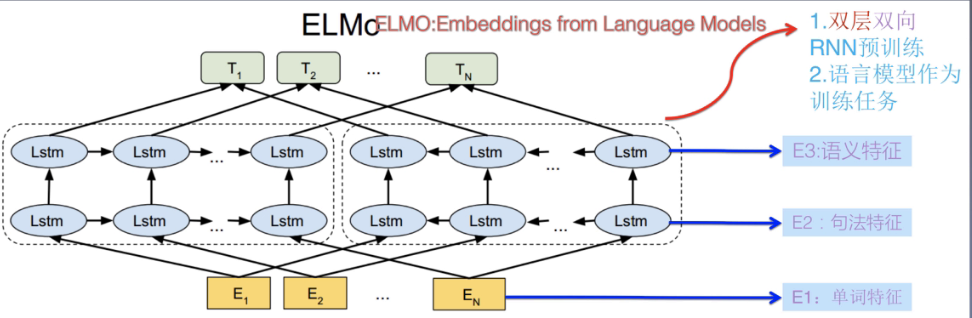

之前的问题也就在于，**word embedding 是个静态的方式**，所以在使用的时候，不论新句子上下文是什么，这个单词的向量都不会跟这个上下文的变化而改变。而ELMo的思想是：事先用语言模型学好一个单词的embedding，在使用word embedding的时候，**根据上下文单词的语义去调整单词表示**，这样经过调整后的embedding更能表达在这个上下文中的具体含义，自然也就能解决多义词的问题了。

ElMo采用了典型的两阶段过程，第一个阶段是利用语言模型进行预训练；第二个阶段是在做下游任务时，从预训练网络中提取对应单词的网络各层的embedding作为新特征补充到下游任务中。对于一个训练好的网络，**句子中每个单词都有对应的三个向量表示**：最底层是单词的word embedding，往上一层包含编码单词的句法信息；最上面一层包含编码单词的语义信息。也就是说，ELMo的预训练过程不仅仅学会单词的embedding，还学会了一个双层双向的LSTM网络结构。

**ELMo存在的问题**

**先说优点：**
1.ELMo完美地解决了多义词问题，不仅如此，最终的表示里还涵盖了很多的词性信息。
2.在6个NLP任务上，相较于baseline都有5%-25%的提升。
**再说缺点：**
1.LSTM的抽取能力远低于Transformer
2.拼接方式使用双向融合，这种特征融合能力相对较弱

除了以ELMo为代表的这种**基于特征融合的预训练方法**外，NLP里还有一种典型做法，也就是**基于Fine-tuning的模式**，而GPT就是这一模式的典型开拓者。

## GPT

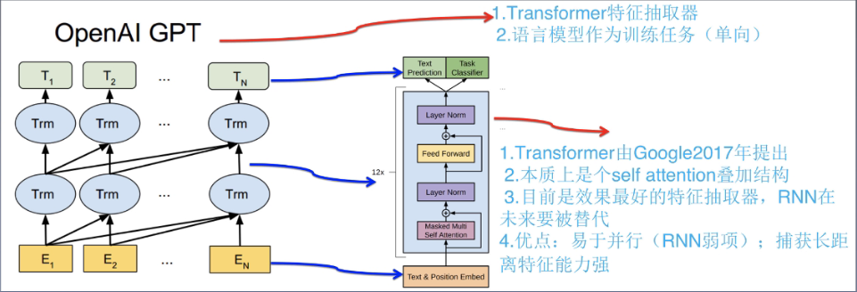

GPT也采用两阶段过程，第一个阶段是利用语言模型进行预训练，第二阶段通过Fine-tuning的模式解决下游任务。其GPT与训练过程和ELMo是类似的，主要不同在于两点：首先，**特征抽取器用的Transformer**，它的特征抽取能力要强于RNN，从现在来看，这个选择很显然是明智的；其次，GPT采用的是**单向的语言模型**，从现在来看，这个选择确实漏掉了很多有用的信息。

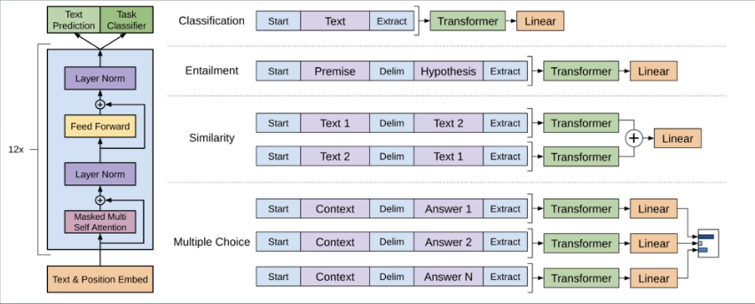

GPT的使用：首先，对于不同的下游任务，本来我们可以任意设计自己的网络结构。现在，我们要把任务的网络结构改造成和GPT的网络结构是一样的。然后，再做下游任务的时候，利用第一步训练好的参数初始化GPT的网络结构，这样通过预训练学到的语言学知识就被引入到下游任务中来了。再次，可以用当前的这个任务去训练网络，对网络参数进行Fine-tuning，使得这个网络更合适解决特定的问题。

GPT论文给出了一种改造施工图：对于**分类问题**，加上一个起始和中止符号即可；对于句**子关系判断问题**，两个句子中间再加个分隔符即可；对**文本相似性度量问题**，把两个句子顺序颠倒一下做出两个输入即可，这是为了告诉模型句子顺序不重要；对于**多选择问题**，则多路输入，每一路把文章和答案选项拼作为输入即可。整体来看，这种做法和下游任务中使用BERT是非常类似的。

## 从Word Embedding、ELMo、GPT 到 BERT

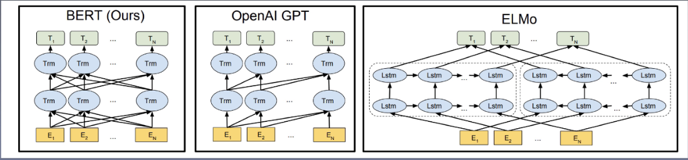

Bert其实和ELMo及GPT存在千丝万缕的关系：
	如果我们把GPT的**预训练阶段换成双向语言模型**，那么就得到了Bert
	如果我们把ELMo的**特征抽取器换成Transformer**，那么也得到了Bert
可以看出，Bert最关键有两点，第一点是**特征抽取器采用Transformer**，第二点是**预训练的时候采用双向语言模型**。

# **自然语言处理通用框架BERT**

## NLP中的四大任务

**序列标注**：**分词/POS Tagginh/NER... ...**
			要求模型根据上下文对句子中**每个单词（位置）**给出一个分类级别
**文本分类：文本分类/情感分类/关系分类... ...**
			要求模型根据句子语义对**句子整体**做一个类别判断
**句子关系判断:（非生成式）问答/自然语言推理... ...**
			给定两个句子，模型判断出**两个句子**是否具备某种语义关系
**生成式任务：机器翻译/（生成式）文本摘要/（生成式）回答... ...**
			输入文本内容后，需要自主生成另一段文字

深度学习要求我们设计端到端的模型，那么特征抽取器的选择也就显得至关重要。

## RNN网络

**RNN的核心思想**就是输入对应隐层节点，隐层节点之间形成线性序列，信息由前向后在隐层之间逐步向后传递。在此基础上，为了缓解梯度爆炸与梯度消失问题，研究者们在RNN中引入门机制，产生了LSTM和GRU等等。以及通过引入**注意力机制**来完善编码-解码框架，使用双向RNN，叠加RNN等等操作，都使得其在自然语言处理领域长期占据稳定地位，是序列建模任务的标准配置。
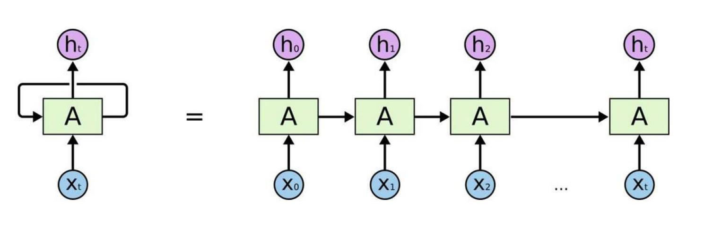

**RNN的致命缺点：**
		**慢：**RNN本身的序列依赖结构对于大规模并行计算来说相当不友好，所以后面也就延续出了两个方向，一个是RNN的加速（RNN的并行化），另一个是寻求新模型，包括使用CNN或者Transformer等方法。

## CNN网络

卷积操作运作机制的关键在于**卷积核覆盖的那个滑动窗口**，CNN能不或道德特征就体现在这个滑动窗口里，其实他捕获到的是单词的k-gram片段信息，这些k-gram片段就是CNN捕获到的特征，k的大小决定了能捕获多远距离的特征，相对应的解决方案有两种，一种是层叠卷积，另一种是扩展卷积（时间卷积网络是其集大成者）。与此同时，在CNN中加入位置特征也成了其在自然语言处理中的标配。
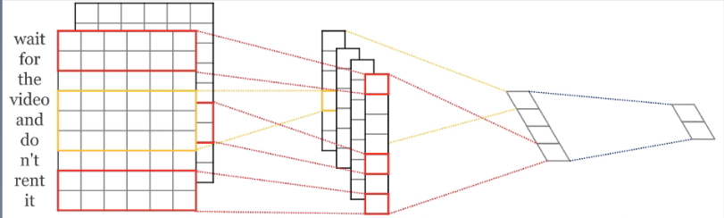

**CNN的缺点：**
		**无法捕获长距离依赖**：CNN对信息的感知能力取决于对卷积核的大小。
		**对位置信息不敏感**：池化操作会削弱句子中的位置特征。

## Transformer

**这里的的Transformer特征抽取器并非原始论文所指的完整的Encoder-Decoder框架，从特征提取器角度来说的，我们可以简单理解为论文中的Encoder部分。**Transformer原文中一直强调说self-attention，但目前来看，能让Transformer效果好的，不仅仅是self-attention，而是整个Block里所有元素，包括multi-head self-attention，skip-connection，layer-norm，feed-forward network一起在发挥作用。

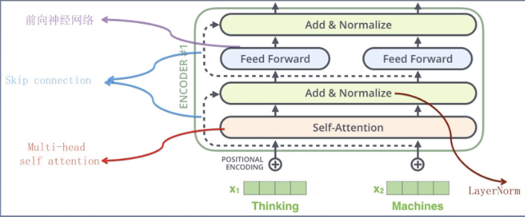

针对NLP任务的特点，来说Transformer对应解决方案：
1.自然语言一般是个**不定长**的句子，针对这个问题，Transformer做法跟CNN是类似的，一般设定输入的最大长度，如果句子没那么长，则用**padding填充**。
2.句子中单词之间的**相对位置**包含很多有用信息，RNN因为结构就是线性序列的，天然会将位置信息编码进模型；而CNN的卷积层其实也是保留部分位置相对信息。Transformer输入的第一层网络是multi-head self-attention层，这个过程中位置信息并没有被编码进去。所以，Transformer在输入端明确地**将postion信息编码**。
3.关于**长距离依赖**的问题，**self-attention天然地就能解决这个问题**，因为在集成信息的时候，当前单词和句子中任意单词都发生了联系。不像RNN需要通过隐层节点序列往后传，也不像CNN需要通过增加网络深度来捕获远距离特征。

## 对比

**语义特征抽取能力**：
				Transformer > CNN = RNN

**长距离特征捕获能力**：
				Transformer > RNN > CNN

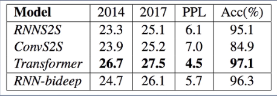

**并行计算能力及运算效率**：
				Transformer  = CNN  >> RNN

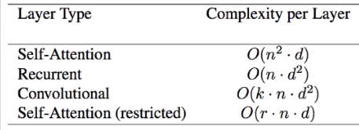

## 注意力机制

1.对于输入的数据，你的关注点是什么？
	

 上面例子中，鸟类的如片卷积网络提取特征的过程中，我们的关注点在一个个的特征图上面。所以说你希望计算机关注到的是什么，这个不是在开始加入向量加权认为去设置谁重要的，关键在于自己的任务目标是什么，至于什么重要一定是计算机通过上下文来做一个判断。
2.self-attention是什么？
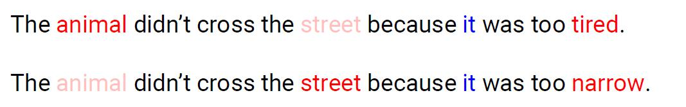

上面两句话中，第一句话中it指代animal，第二句话中是指代这条路。self-attention是什么呢？对于上面例子的话如果要对it这个词做一个self-attention，那么it就不是只考虑自己了，它需要考虑当前输入的一个整体，也就是如果对it编码，就不是只对这一个词进行编码了，而是要把前面/后面每一个词与他之间的关系占的比例是多少都需要让计算机知道。
所以说怎么让计算机更好的理解自然语言处理任务？也就是能计算机能够自己知道这个it指代什么。

总结：self-attention说了这样一件事，当对词做编码的时候，不简简单单考虑当前这个词，而是要考虑当前词所处的上下文语境要把整个上下文语境融入到当前这一个词向量当中这就是self-attention。

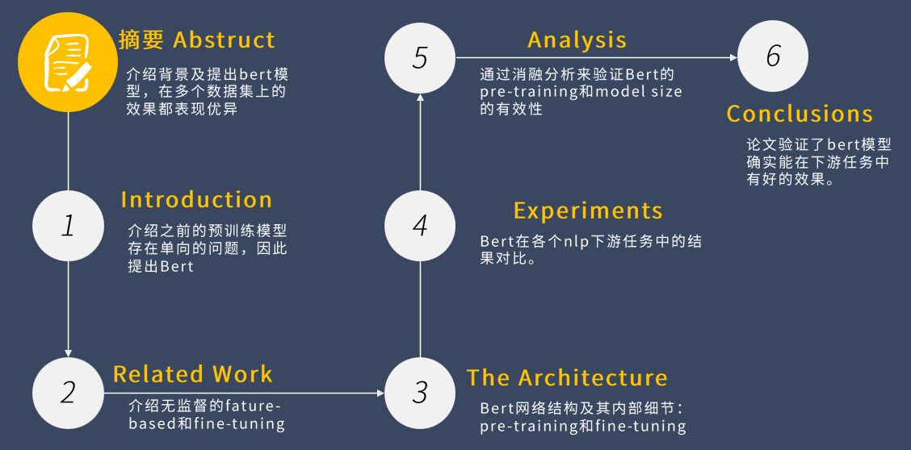

关于论文的结构解读：
Introduction：简单介绍之前预训练模型是怎么做的，bert又是怎么去做的，对比贡献。
Related Work：相关的工作介绍，介绍一下各种各样的其他人的算法都是怎么去做的。
The Architecture：Bert模型的具体实现。
Experiments：设计实验，对比Bert在各个nlp下游任务中的结果。
Analysis：通过消融分析对比实验验证模块的有效性。
Conclusions：总结

## 论文摘要概述

这篇论文中的**BERT模型**是自然语言处理中一个**通用的解决方案**。
通用解决方案是指：这篇论文的BERT模型能应用的很多领域当中，比如说自然语言处理中的情感分析、分类问题、命名实体识别、机器翻译等多个领域。且该论文强调了这一点：该算法可以应用到各个自然语言处理的领域当中，相当于它一个网络架构可以解决好多个问题。这个方便了学习工作中的任务需要可以考虑往这个bert模型中套用，所以说它不仅仅不是一篇论文也是一个通用的解决方案。

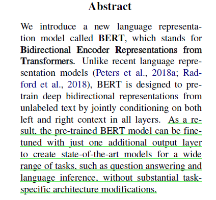

语言模型的真正意义是什么？语言模型试图解决哪些问题？从本质上讲，他们的任务是根据上下文“填空”。例如下面这个例子：“那位女士去商店买了一双 _____ 鞋子。”语言模型在完成这个句子时会设置 20%的权重使用单词“cart”，80%的权重可能使用单词“pair”。

在 BERT 出现之前，语言模型需要通过对文本序列从左至右或者再结合从右向左的扫描方式理解文本。这种单向的方法比较适合生成句子——它可以预测下一个单词，将它添加到序列中，然后接着预测下一个单词，直到形成一个完整的句子。

有了 BERT 之后，便可以创建一个双向训练的语言模型（这也是它的关键技术创新）。与单向语言模型相比，这意味着我们现在可以对语境和语言流有更深刻的理解了。

BERT 并不是按顺序预测下一个单词的，而是使用了一种称为 Masked LM （MLM）的技术：它随机 mask 句子中的单词，然后尝试预测它们。mask 意味着模型将从两个方向观察，它使用句子的全部上下文，包括左边和右边的环境，来预测被 mask 的词。与之前的语言模型不同，它会同时考虑前一个和下一个标记。现有的基于 LSTM 的从左到右和从右到左的组合模型缺少这个“相同时间的部分”。（更准确地说，BERT 是没有方向性的。）个人的形象理解仅供参考：BERT像是在做完形填空一样，从左往右可以预测，从右往左也可以预测，空里拿出去一个词问那个词最合适。

## BERT 的工作原理

BERT 依附于“Transformer”（一种标注机制，用来学习文本中单词之间的上下文关系）。一个基本的 Transformer  包括一个编码器，用来读取文本输入，一个解码器，用来产生关于任务的预测。由于 BERT 的目标是生成语言表示模型，所以它只需要编码器部分。

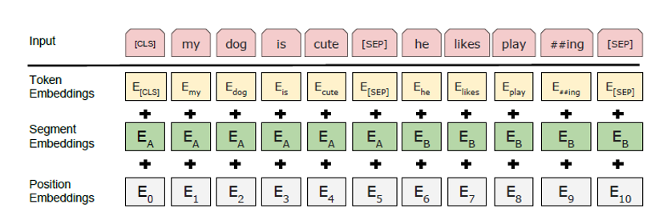

BERT 的编码器的输入是一个 tokens 序列，它首先被转换成向量，然后在神经网络中进行处理。但是在开始处理之前，BERT 需要对输入进行处理并添加一些额外的元数据：
【SEP】：若输入是两句话，中间加了一个特殊字符【SEP】把他们隔开，理解为分隔符。
【CLS】：全局的一个向量。
最终我们是要做一个分类或者回归任务（NLP中分类任务偏多很少有回归任务），所有都需要有一些向量，做一些计算，得到一个结果。这个cls就是比如分类任务中用到的一个向量。
为什么要在第一句话中引入这个特殊字符【CLS】呢？BERT做了一个完形填空的事情，在做完形填空的时候每一个词都要考虑上下文语境。当我引入一个特殊字符，我这个特殊字符也需要考虑上下文和语境。【CLS】虽然可以说是一个特殊字符，其实他是一个全局的特征的表达，因为它要看每一个词，它就被当作是整个语境一个综合的向量。所以最终做一个分类结果做一个预测的时候就拿整个整体的【CLS】去做预测。

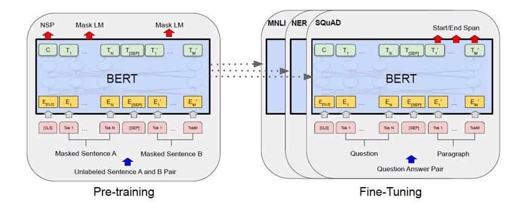

**Fine-Tuning 下游任务**
下游任务：阅读理解（SQuAD）、命名实体识别（NER）、其他任务......各种各样的任务
在应用的时候：直接把BERT训练好的权重参数拿过来当做一个初始化，整个网络结构都是一摸一样的。
整个网络在做一个什么事情呢？就是如何去做特征的提取。
论文中有这样一句话：我们的一个预训练模型可以应用到各种各样的任务当中，但是我们的整个架构在不同的任务当中是不变的！

## BERT预训练策略

**Mask LM （掩码语言模型）**

其指导思想是“简单”：随机选择预料中的15%的单词，把他扣掉，也就是用[MASK]掩码代替原始单词，然后要求模型去正确的预测被挖掉的词，这里遵循的也就是语言模型预测单词的思想，但是这里有个问题：训练过程大量看到[MASK]标记，但是后面用的时候是不会有这个标记的，这回引导模型认为输出是针对[MASK]标记的。

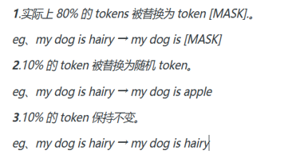

为了避免这个问题，BERT对这个任务进行了进一步的改造：对于这15%的要执行[MASK]人物的单词中，只有80%真正被替换成[MASK]标记，10%的单词被随机替换成另外一个单词，剩余的10%的单词不做变化。一定程度上缓解了这个问题。

**Next Sentence Prediction (下个句子预测)**

我们在做语言模型预训练的时候，分两种情况选择两个句子，一种是选择预料中真正顺序相连的句子，另一种是从语料库中随机选择一个频道第一个句子后面。

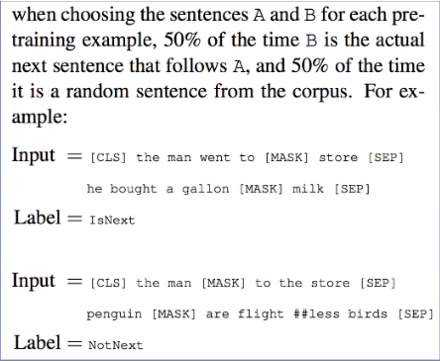

BERT要求模型除了作上述的Mask语言模型任务外，附带在做个句子关系预测，判断第二个句子是不是真的是第一个句子的后续句子。之所以这么做，是考虑到很多NLP任务是句子关系判断任务，单词预测粒度的训练到不句子关系这个层级，增加这个任务有利于下游句子关系判断任务。所以可以看到，BERT的预训练是个多任务过程，这也是其创新之处。

## BERT的使用

NLP四大任务里，除了生成类任务外，BERT都覆盖到了，而且改造起来很简单直观。其实对于机器翻译或者文本摘要这种生成式任务，同样可以稍作改造即可引入BERT，比如直接在单个Transformer结构上假装隐层产生输出。

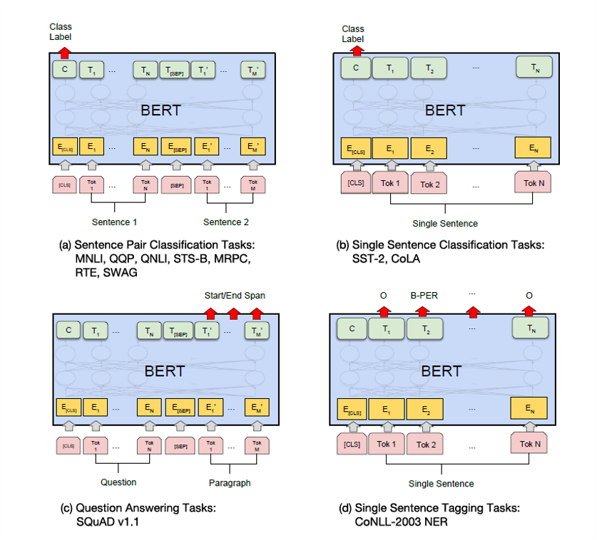

那么，针对特定的任务场景，我们如何进行 fine-tune 呢？BERT 可以用于各种各样的语言任务中。如果我们想要基于我们自己的数据集对原始模型进行微调，只需在核心模型上添加一个独立层即可。

例如，假设我们正在创建一个问答应用程序。本质上，问题问答只是一个预测任务——在接收一个问题作为输入时，应用程序的目标是从一些语料库中识别正确的答案。因此，给定一个问题和一个上下文段落，该模型预测该段落中最有可能回答该问题的开始和结束标记。这意味着我们可以使用 BERT 模型通过学习两个额外的向量来训练我们的应用程序，这两个向量分别表示答案的开头和结尾。

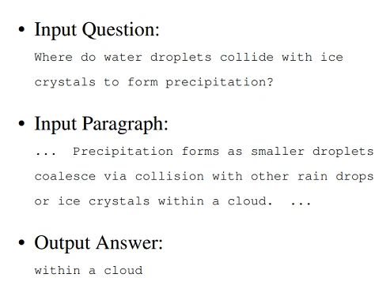

就像句子对任务一样，问题变成了输入序列中的第一个句子，段落变成了第二个句子。不过，在这里 fine-tune 过程中加入了两个新参数：开始向量和结束向量。在 fine-tune 训练中，超参数与 BERT 训练保持一致；本文对需要调整的超参数给出了具体的指导。注意，如果我们想进行 fine-tune，我们需要转换数据输入的格式，以满足预训练核心 BERT 模型的特殊格式要求。例如：我们需要添加特殊 token 来标记开始（（CLS））、分离/结束的句子（[ SEP]）以及 segment IDs，以达到区分不同句子的目的，最终才能将数据转换成 BERT 使用的特性。

无论如何从这里可以看出，NLP四大类任务都可以比较方便的改造成BERT能够接受的方式，这意味着她几乎可以做任何NLP的下游任务，具有很强的普适性。

## 实验设置
数据集

**GLUE** （通用语言理解评估：包括情感分类、自然语言推理、问答对匹配、文本分类、语义相似度匹配、复述检测等一系列任务，共计8个数据集）

SQuAD v1.1&v2.0（斯坦福机器阅读理解数据集：给出一段文本和一个问题，从文本中标出答案的开始位置和结束位置）

**SWAG**(给出一个陈述句子和四个候选句子，判断前者和后者中的哪一个最后逻辑的连续性，相当于是一个阅读理解问题，用于评估基于常识的推理)

## 实验结果

**影响因子分析**

我们说BERT效果特别好，那么到底是什么因素起效果呢？对比实验可以证明，跟[GPT](./从Word Embedding到BERT.png)相比，双向语言模型起到了最主要的作用，对于那些需要看到下文的任务来说尤其如此，而预测下个句子来说对整体性能来说影响不断太大，跟具体任务关联度比较高。

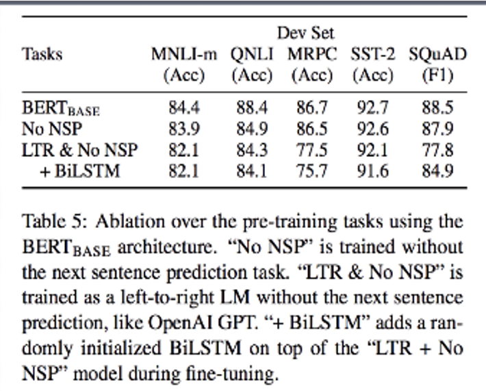

## 总结

BERT 是目前最火爆的 NLP 预训练模型，其基于 MLM 和双向语言模型和以 Transformer 作为特征抽取器，是其成功最主要的两个原因。BERT 也是一个非常强大的语言模型，它是 NLP 领域的一个重要里程碑——它极大地提高了我们在 NLP 中进行迁移学习的能力；它可以为各种各样的 NLP 任务提供解决方案。

通过上述对 BERT 的解析，我们心里应该能够给 BERT 一个清晰的定位。BERT 是一个强大的预训练，因其超大的参数量和较强的特征提取能力，能够从海量的语料中学习到一些语言学和一定程度的语义信息。但是，我个人认为，跟此前的所有 NLP 模型一样，它还远没有学习到语言中蕴含的大量的常识和推理。例如，利用 BERT 或许能够从"天下雨了"，推断出“要带伞”。但是更深层次的，“要带伞是因为怕淋湿，淋湿了会感冒”这些 BERT 是很难学到的。

NLP 的难处就在于，语言是高度精炼和情境化的。一句简单的话，可能需要丰富的知识才能理解。现在来看，预训练模型是一条有希望但漫长的道路。

# 参考文献
[^0]: BERT: Pre-training of Deep Bidirectional Transformers for Language Understanding .arXiv preprint arXiv:1810.04805v2. 2019.
[^1]: https://towardsml.wordpress.com/2019/09/17/bert-explained-a-complete-guide-with-theory-and-tutorial/
[^2]: https://www.infoq.cn/article/UhS0UsctOQ2pbiXL3SAY